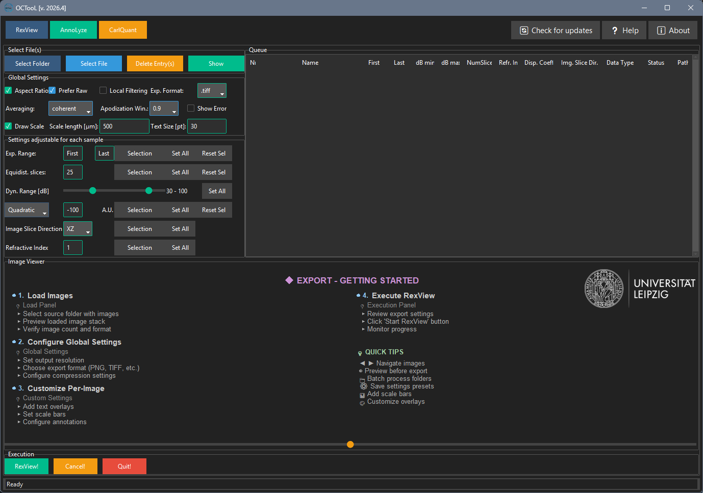
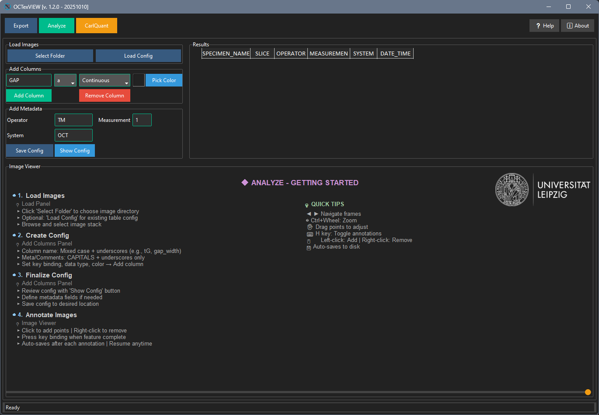
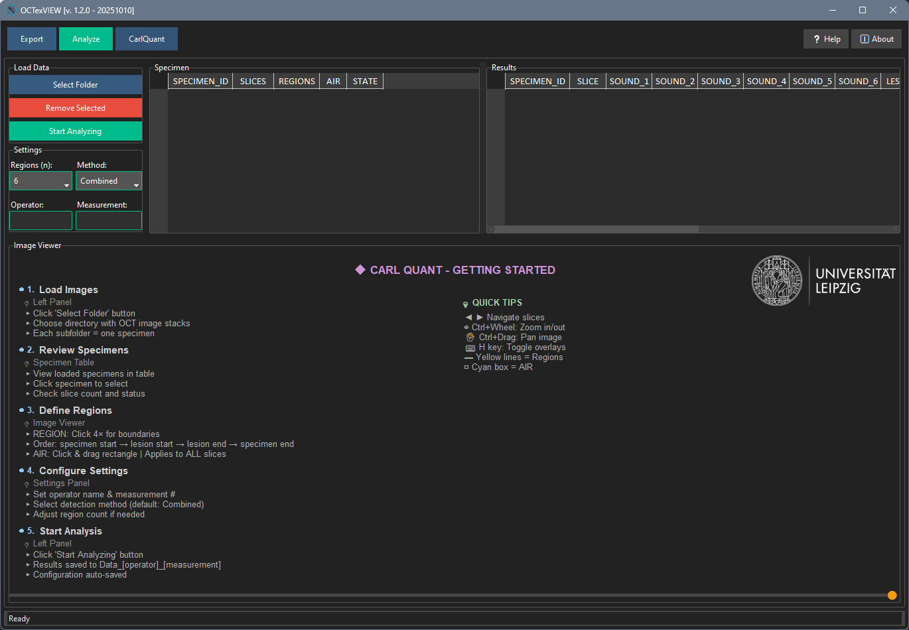

# Introduction

**OCTooL** is a software application designed for the export, analysis and quantification of Optical Coherence Tomography (OCT) images. Developed specifically for dental and medical research applications, OCTooL provides researchers and clinicians with tools to extract data from OCT imaging studies.

## Purpose and Scope

OCTooL addresses the need for standardized, reproducible analysis of OCT images in research environments. The software enables users to:

-   **Process large datasets** of OCT images efficiently
-   **Extract quantitative measurements** from tissue structures
-   **Apply consistent analysis protocols** across multiple specimens
-   **Maintain data integrity** through automated workflows

The application is particularly valuable for studies involving simple feature characterization, structural analysis, and longitudinal monitoring of samples.

## System Requirements

-   **Operating System**: Windows 10/11, macOS 10.15+, or Linux
-   **Memory**: Minimum 8GB RAM (16GB recommended for large datasets)
-   **Storage**: At least 2GB free space for installation and temporary files
-   **Display**: Minimum 1920x1080 resolution for optimal interface experience

## Application Overview

OCTooL is organized into three main functional sections, each designed for specific aspects of OCT image analysis:

### RexView Section {.unnumbered}

The **RexView** section focuses on data preparation and batch processing capabilities. This module allows users to:

-   Import and organize large collections of OCT image files
-   Configure global processing parameters
-   Apply custom settings to specific datasets
-   Execute batch operations across multiple specimens
-   RexView processed data in various formats

*Primary Use Case*: Preparing raw OCT data for analysis and converting from OCT raw data to `png` files.

### AnnoLyze Section {.unnumbered}

The **AnnoLyze** section provides comprehensive tools for detailed image analysis and annotation. Key features include:

-   Interactive image viewing and navigation
-   Manual annotation tools
-   Measurement and quantification capabilities
-   Results compilation and statistical analysis
-   Metadata management and documentation

*Primary Use Case*: Detailed analysis of individual specimens with manual oversight and quality control.

### CarlQuant Section {.unnumbered}

The **CarlQuant** section implements advanced quantitative analysis algorithms specifically developed for OCT image analysis. This module offers:

-   region-of-interest selection
-   Specialized lesion detpt algorithms
-   Batch processing with consistent parameters
-   Advanced statistical analysis and reporting
-   Integration with research databases

*Primary Use Case*: High-throughput quantitative analysis using validated algorithms for research studies.

## Workflow Integration

The three sections are designed to work together in a typical research workflow:

1.  **Data Preparation** (RexView): Import and organize raw OCT files
2.  **Image Anotatoion** (AnnoLyze): Review and annotate specimens
3.  **Quantitative Analysis** (CarlQuant): Apply leasion depth algoryth to generate research data

However, each section can also function independently, allowing users to enter the workflow at any point based on their specific needs.

------------------------------------------------------------------------

# RexView Section



The RexView Section is the primary module for batch processing and converting OCT raw data files into standard image formats (PNG or TIFF). This section provides comprehensive control over image processing parameters, slice selection, and export settings.

## Typical Workflow

1.  **Load Files**: Use "Select Folder" or "Select File" to add OCT files to the queue
2.  **Configure Global Settings**: Set export format, averaging method, and scale bar preferences
3.  **Adjust Custom Settings**: Fine-tune slice ranges, dynamic range, and other parameters for specific files
4.  **Preview**: Select a file and click "Show" to preview the export result
5.  **RexView**: Click "RexView!" to process all files in the queue
6.  **Monitor Progress**: Watch the Status column for processing updates

## File Selection Panel

The File Selection Panel allows you to load OCT files into the processing queue.

### Select Folder

**Purpose**: Choose a folder which contains at least one OCT file. All OCT files inside this folder and subfolders are detected and added to the queue.

**Advanced Feature**: If you supply a plain text file within an OCT-File directory \[\*.txt\] with information about export range and equidistant slices, those parameters are imported automatically.

**Format example**:

```         
33-444
25
```

Or with advanced syntax:

```         
XZ:20-80:20:1
YZ:15-90:10:1.5
```

Where the format is: `[View]:[start]-[end]:[numSlices]:[refractiveIndex]`

### Select File

**Purpose**: Choose a single OCT file for processing.

### Delete Entry(s)

**Purpose**: Delete one or more selected items in the queue.

### Show

**Purpose**: Select an OCT-Scan from the queue and display it in the preview canvas. Move the slider to display different slices.

## Global Settings Panel

Global settings apply to all files in the export queue and control fundamental processing parameters.

### Aspect Ratio

**Purpose**: Corrects pixel aspect ratio for natural-looking images.

**Details**: The pixels of an OCT scan are usually not isometric due to the standard acquisition parameters (x and y pixel size). A correction factor is calculated here so that the image does not look compressed or stretched, which makes the image appear natural.

**Default**: Enabled

### Prefer Raw

**Purpose**: When a scan contains both raw and processed data, this option determines which to use.

**Details**: If a scan was recorded as raw data and as spectral data, you can select here between processed and raw data export.

**Status**: Not yet fully implemented

**Default**: Enabled

### Local Filtering

**Purpose**: Experimental noise reduction filter for raw scans.

**Details**: This filter can reduce noise if a raw scan is available. The filter operates in 32bit color space and takes advantage of the "speckle" property of OCT. It detects strong deviations of a pixel from the mean gray value of the surrounding pixels and corrects this in a kind of median smoothing with a predefined box kernel size. Since this is done by iterating over a B-scan columns and rows, this correction can take some time.

**Default**: Disabled

**Warning**: This is an experimental feature and may significantly increase processing time.

### RexView Format

**Purpose**: Select the output image format.

**Options**: - **PNG**: Results in smaller file size, suitable for most applications - **TIFF**: Ideal for post-processing and when maximum quality is required

**Default**: TIFF

### Averaging

**Purpose**: Control how A-scans are averaged when averaging was activated during recording.

**Options**: - **None**: No averaging applied - **Incoherent**: Leads to a noise-reduced image - **Coherent**: Results in a signal-intensive image

**Default**: Coherent

### Apodization Window

**Purpose**: Control the Tukey window size for spectral apodization.

**Details**: The pixels of an OCT scan are usually not isometric due to the standard acquisition parameters (x and y pixel size). A correction factor is calculated here so that the image does not look compressed or stretched, which makes the image appear natural.

**Options**: 0, 0.3, 0.5, 0.7, 0.9, 1

**Default**: 0.9

### Show Error

**Purpose**: Control whether error messages are displayed when text files are missing.

**Details**: If no text file is supplied next to the OCT file, an error message is displayed. You can disable/enable this here. It will suppress the error message.

**Default**: Disabled

### Draw Scale

**Purpose**: Insert a scale bar in the right corner of the image.

**Details**: Choose scale length and text size according to your needs.

**Default**: Enabled

#### Scale Length \[µm\]

**Purpose**: Define the physical length of the scale bar.

**Details**: Insert a number here. Most common are 250, 500, 1000.

**Default**: 500 µm

#### Text Size \[pt\]

**Purpose**: Define the font size for the scale bar label.

**Details**: Insert a number for text size here, e.g., 24 or 30.

**Default**: 30 pt

## Custom Settings Panel

Custom settings allow fine-tuned control over individual files or selections in the queue.

### RexView Range

**Purpose**: Manually enter the first and last slice to be exported.

**Controls**: - **First**: Starting slice number - **Last**: Ending slice number - **Selection**: Apply the range to the currently selected entry - **Set All**: Apply the range to all entries in the queue - **Reset Sel**: Sets the first level to 1 and the last level to the last available level

### Equidistant Slices

**Purpose**: RexView evenly distributed slices from a scan.

**Details**: To export evenly distributed slices from a scan, the number can be entered here and transferred to all or one entry in the queue.

**Controls**: - **Number Entry**: Enter the desired number of equidistant slices (default: 25) - **Selection**: Apply to the currently selected entry - **Set All**: Apply to all entries in the queue - **Reset Sel**: Resets the value to "all slices"

### Dynamic Range \[dB\]

**Purpose**: Adjust the signal-to-noise ratio and image contrast.

**Details**: Roughly speaking, the dynamic range indicates the range between the darkest and lightest grey values. A kind of contrast adjustment takes place, so to speak. In the concrete case, the signal-to-noise ratio is defined here.

**Controls**: - **Min dB Slider**: Set the minimum decibel threshold - **Max dB Slider**: Set the maximum decibel threshold - **Selection**: Apply to the currently selected entry - **Set All**: Apply to all entries in the queue

### Dispersion Compensation

**Purpose**: Correct for chromatic dispersion artifacts in OCT images.

**Details**: Dispersion compensation can improve image quality by correcting phase distortions.

**Controls**: - **Method**: Select dispersion compensation method (e.g., Quadratic) - **Coefficient**: Enter the dispersion coefficient value (default: -100) - **Selection**: Add value to selection - **Set All**: Add value to all in queue - **Reset Sel**: Reset values to -100

### Image Slice Direction

**Purpose**: Define the orientation of exported image slices.

**Details**: Define the image slice direction here. First character is always the X axis (width) and second always the Y axis (height) of the resulting image.

**Options**: - **XZ**: 2D projection along the XZ plane - **YZ**: 2D projection along the YZ plane (standard) - **XY**: 2D projection along the XY plane (en-face view)

**Controls**: - **Selection**: Apply to the currently selected entry - **Set All**: Apply to all entries in the queue

**Note**: Changing the slice direction automatically updates the "Last" slice value based on the scan dimensions.

### Refractive Index

**Purpose**: Apply refractive index correction to account for material properties.

**Details**: Defines how much the image is stretched or compressed. A value of 1 shows true surface dimensions; higher values distort the surface but retain approximate depth accuracy.

**Usage**: Enter the refractive index (e.g., 1.0). Values \>1 stretch the surface while maintaining depth cues. Use with caution for samples with varying indices.

**Controls**: - **Entry Field**: Enter refractive index value (default: 1.0) - **Selection**: Add value to selection - **Set All**: Add value to all in queue

**Common Values**: - Air: 1.0 - Water: 1.33 - Dental enamel: \~1.63 - Dental dentin: \~1.54

## Execution Panel

The Execution Panel controls the export process and application lifecycle.

### RexView!

**Purpose**: Start exporting of all entries in queue.

**Details**: Initiates batch processing of all OCT files in the queue with their configured settings. Progress is displayed in the Status column of the queue table.

### Cancel!

**Purpose**: Stop the current export process.

**Details**: Interrupts the export operation. Files already processed will remain saved.

### Quit!

**Purpose**: Exit the application.

**Details**: Closes OCTooL. Unsaved queue configurations will be lost.

## Queue Table

The queue table displays all loaded OCT files and their export parameters. Each row represents one OCT file with the following columns:

-   **Nr.**: Sequential number
-   **Name**: Filename without extension
-   **First**: First slice to export
-   **Last**: Last slice to export
-   **dB min**: Minimum decibel threshold
-   **dB max**: Maximum decibel threshold
-   **NumSlices**: Number of slices to export
-   **Refr. Ind.**: Refractive index correction
-   **Disp. Coeff**: Dispersion compensation coefficient
-   **Img. Slice Dir.**: Image slice direction (XZ, YZ, or XY)
-   **Data Type**: Raw or Processed
-   **Status**: Current processing status
-   **Path**: Full path to the OCT file

**Interaction**: Double-click any cell to edit its value directly. Select multiple rows to apply batch operations.

## Output Structure

Exported files are saved in subdirectories next to the original OCT files with the following naming convention:

```         
[ExpNumber]_[FileName]_[NumSlices]_Slices_[SliceDirection]/
    [FileName]_[ExpNumber]_#[SliceIndex]_[ImageNumber].png
```

Additionally, a video image (overview) is saved as:

```         
[FileName]_[ExpNumber].jpg
```

# AnnoLyze Section



The AnnoLyze Section provides comprehensive tools for interactive image annotation, measurement, and data collection. This module is designed for detailed analysis of individual specimens with manual oversight and quality control, enabling researchers to annotate features, collect measurements, and compile results in a structured format.

## Typical Workflow

1.  **Load Images**: Click "Select Folder" to load a folder of images
2.  **Configure Columns**:
    -   Define custom columns with appropriate data types
    -   Assign keyboard shortcuts
    -   Choose colors for visual organization
3.  **Optional - Load Config**: Load a previously saved configuration to restore column setup
4.  **Annotate and Measure**:
    -   Navigate through images using arrow keys
    -   Draw annotations by clicking to add points
    -   Press F to toggle between line and spline modes
    -   Press assigned key to commit annotation and record measurement
5.  **Enter Additional Data**: Use keyboard shortcuts to enter Boolean, Categorical, or other data types
6.  **Review**: Press H to toggle annotation visibility and review your work
7.  **Undo if Needed**: Use Ctrl+Z for quick undo or Ctrl+U for selective undo
8.  **Save Configuration**: Click "Save Config" to save your column setup for future use

## Load Images Panel

The Load Images Panel allows you to import image files and configure the analysis workspace.

### Select Folder

**Purpose**: Choose a folder that contains OCT Image(s).

**Supported Formats**: PNG, JPG, TIF, TIFF

**Details**: All supported image files in the selected folder are automatically loaded and sorted naturally (e.g., image1, image2, image10). The folder name becomes the specimen name in the results table.

### Load Config

**Purpose**: Load a configuration file for layout and key bindings.

**Details**: Configuration files (JSON format) store custom column definitions, key bindings, data types, and colors. This allows you to quickly set up the same analysis parameters across multiple sessions or specimens.

## Image Annotation Canvas

The central canvas displays the current image and provides interactive tools for annotation and measurement.

### Navigation Controls

**Keyboard Shortcuts**: - **Arrow Keys (←/→)**: Navigate between images - **Arrow Keys (↑/↓)**: Navigate between images - **Mouse Wheel**: Zoom in/out - **Middle Mouse Button + Drag**: Pan the image - **H Key**: Toggle annotation visibility

**Mouse Controls**: - **Left Click**: Add annotation point - **Left Click + Drag**: Move existing annotation point (when hovering over a point) - **Right Click on Point**: Remove individual annotation point - **Right Click on Empty Space**: Clear all uncommitted annotation points

### Annotation Features

#### Point-Based Annotations

**Purpose**: Create line or spline annotations by clicking to add control points.

**Details**: Click on the image to add points that define a measurement path. Points can be dragged to adjust position. The annotation remains editable until committed to the results table via a keyboard shortcut.

**Visual Feedback**: - **Yellow outline**: Normal point state - **Green outline**: Hovering over a point (ready to drag) - **White outline**: Point being dragged - **Cursor changes to hand**: When hovering over a draggable point

#### Line vs. Spline Mode

**Purpose**: Toggle between straight-line and smooth curve interpolation.

**Keyboard Shortcut**: **F Key**

**Details**: - **Line Mode**: Connects points with straight line segments (default) - **Spline Mode**: Creates smooth cubic spline curves through points (requires minimum 4 points) - Dashed lines indicate spline mode is active but more points are needed

#### Annotation Visibility

**Purpose**: Toggle display of committed annotations and overlay data.

**Keyboard Shortcut**: **H Key**

**Details**: Press H to show/hide all committed annotations and non-drawn data overlays (Boolean, Categorical, Ordinal, Text/String values). Current uncommitted annotations remain visible for editing.

### Zoom and Pan

**Zoom Controls**: - **Mouse Wheel Up**: Zoom in (centered on cursor position) - **Mouse Wheel Down**: Zoom out - **Zoom Range**: 0.1x to 10x magnification

**Pan Controls**: - **Middle Mouse Button + Drag**: Pan the zoomed image - **Auto-centering**: Image automatically centers when zoomed

## Add Columns Panel

The Add Columns Panel allows you to define custom data columns with keyboard shortcuts for rapid data entry.

### Column Name Entry

**Purpose**: Enter the name of the column.

**Example**: GAP, Interface, Lesion, Crack

**Details**: Column names appear as headers in the results table and should be descriptive of the feature being measured or annotated.

### Key Binding Dropdown

**Purpose**: Select a unique key to bind this column.

**Details**: Choose an available letter key (a-z) to create a keyboard shortcut for this column. Reserved keys (F, H) are excluded. Each key can only be assigned to one column.

### Data Type Dropdown

**Purpose**: Select the type of data stored in this column.

**Options**:

-   **Continuous**: A number that can take any value within a range. Used for measurements like length (mm, cm, m), weight (kg), or time (seconds). Automatically calculates length from drawn annotations and accumulates multiple measurements per slice.

-   **Percentage**: A value expressed as a part of 100. Useful for proportions or rates. Increments by 5% with each key press (0% → 5% → 10% → ... → 100%).

-   **Boolean**: A simple Yes/No or True/False value. Great for binary decisions. Toggles between YES and NO with each key press.

-   **Categorical**: A label or category that describes a group. Not ordered. Increments as integer categories (0, 1, 2, ...).

-   **Ordinal**: Categories that have a meaningful order, but not necessarily equal spacing. Increments as ordered scores (0, 1, 2, ...).

-   **Integer**: Whole numbers without decimals. Used for counts or discrete values. Prompts for manual entry.

-   **Float**: Decimal numbers. More precise than integers. Prompts for manual entry (accepts comma or period as decimal separator).

-   **Text/String**: Free-form text or labels. Can be names, comments, or descriptions. Prompts for manual entry.

**Default**: Continuous

### Color Picker

**Purpose**: Choose a color for this column (hex format).

**Details**: The selected color is used to highlight the column in the results table and to color annotations associated with this column. Click "Pick Color" to open a color picker dialog. The color preview shows the currently selected color.

### Add Column Button

**Purpose**: Add a new custom column to the results table.

**Details**: Creates a new column with the specified name, keybinding, data type, and color. The keybinding allows quick data entry using keyboard shortcuts during image annotation. The column is inserted after the SLICE column.

### Remove Column Button

**Purpose**: Remove the last added custom column.

**Details**: Deletes the most recently added dynamic column from the results table and frees up its associated key binding for reuse.

## Metadata Panel

The Metadata Panel captures contextual information about the analysis session.

### Operator

**Purpose**: Define the Operator Abbreviation.

**Example**: TM, CR, JD

**Details**: Enter the initials or abbreviation of the person performing the analysis. This value is automatically added to each row in the results table.

**Default**: TM

### Measurement

**Purpose**: Measurement Number.

**Example**: 1, 2, 3

**Details**: Enter the measurement session number. Useful for tracking repeated measurements or different measurement sessions on the same specimen.

**Default**: 1

### System

**Purpose**: Define the imaging system used.

**Example**: OCT, µCT, SEM, LiMi

**Details**: Enter the abbreviation for the imaging system or technique used to acquire the images.

**Default**: OCT

### Save Config Button

**Purpose**: Save a config file for layout and key bindings.

**Details**: The config is saved as a JSON file in the image folder. It stores all custom column definitions, key bindings, data types, and colors. Load this file in future sessions to quickly restore your analysis setup.

### Show Config Button

**Purpose**: View assigned key bindings in a keyboard layout.

**Details**: Opens a visual keyboard layout window showing which keys are assigned to which columns. Helps prevent duplicate key assignments and provides a quick reference during analysis.

## Results Table

The results table displays all collected measurements and annotations in a spreadsheet format.

### Static Columns

The following columns are automatically populated:

-   **SPECIMEN_NAME**: Folder name of the loaded images
-   **SLICE**: Image number (1-based index)
-   **OPERATOR**: Value from Operator field
-   **MEASUREMENT**: Value from Measurement field
-   **SYSTEM**: Value from System field
-   **DATE_TIME**: Timestamp when data was entered (YYYY-MM-DD HH:MM:SS)

### Dynamic Columns

Custom columns you create appear after the SLICE column. Each dynamic column: - Has a custom background color for easy identification - Is linked to a keyboard shortcut for rapid data entry - Has a defined data type that controls input behavior - Automatically adjusts width based on header length

### Table Interactions

-   **Single Select**: Click to select individual cells
-   **Row Select**: Click row number to select entire row
-   **Copy**: Use Ctrl+C to copy selected cells
-   **Right-Click Menu**: Access additional options
-   **Auto-scroll**: Table automatically scrolls to show the current slice

## Keyboard Shortcuts

### Global Shortcuts

-   **Arrow Keys (←/→/↑/↓)**: Navigate between images
-   **Mouse Wheel**: Zoom in/out
-   **H**: Toggle annotation visibility
-   **F**: Toggle line/spline mode for current annotation
-   **Ctrl+Z**: Undo last action
-   **Ctrl+U**: Open undo history panel

### Custom Column Shortcuts

Each custom column has a unique letter key (a-z, excluding f and h) that triggers data entry:

**For Continuous Data Type**: 1. Draw annotation points on the image 2. Press the assigned key 3. Length is automatically calculated and added to the cell 4. Annotation is committed and colored according to column color

**For Boolean Data Type**: - Press the assigned key to toggle between YES and NO

**For Percentage Data Type**: - Press the assigned key to increment by 5% (wraps at 100%)

**For Categorical/Ordinal Data Type**: - Press the assigned key to increment the category/score number

**For Integer/Float/Text Data Type**: - Press the assigned key to open an input dialog - Enter the value and press Enter or click Submit

## Undo System

### Undo Last Action

**Keyboard Shortcut**: **Ctrl+Z**

**Purpose**: Revert the most recent data entry or annotation.

**Details**: Undoes the last action, restoring the previous cell value and removing any associated annotation. The undo stack preserves the complete history of all actions during the current session.

### Undo History Panel

**Keyboard Shortcut**: **Ctrl+U**

**Purpose**: View complete undo history and selectively undo multiple actions.

**Details**: Opens a table showing all actions with timestamps, slice numbers, column names, old/new values, and annotation IDs. Double-click any row to undo all actions back to that point. Each row is color-coded according to its associated column color.

**Columns**: - **Time**: Timestamp of the action (HH:MM:SS) - **Slice**: Image number where action occurred - **Column**: Column name that was modified - **Old Value**: Previous cell value - **New Value**: New cell value - **Feature**: Feature name from annotation (if applicable) - **Annotation ID**: Unique identifier for associated annotation

## Data Persistence

### Auto-Save

**Details**: All data is automatically saved 1.5 seconds after each action. This includes: - Results table data (CSV format) - Annotations (JSON format) - Configuration (JSON format)

**File Locations**: - `[ImageFolder]/results.csv` - Results table data - `[ImageFolder]/annotations/annotations.json` - All annotations - `[ImageFolder]/config.json` - Column and key binding configuration

### Manual Save

**Details**: Use the "Save Config" button to manually save the current configuration. Results and annotations are saved automatically.

## Output Files

### results.csv

**Format**: Comma-separated values

**Contents**: Complete results table with all static and dynamic columns

**Usage**: Can be opened in Excel, R, Python, or any statistical software

### annotations.json

**Format**: JSON

**Contents**: All annotation data including: - Point coordinates - Annotation mode (line/spline) - Feature labels - Colors - Timestamps - Locked status

**Structure**:

``` json
{
  "slice_0": [
    {
      "id": "GAP_0",
      "feature": "GAP",
      "points": [[x1, y1], [x2, y2], ...],
      "mode": "line",
      "color": "#FF0000",
      "locked": true,
      "timestamp": "2025-01-01T10:00:00"
    }
  ]
}
```

### config.json

**Format**: JSON

**Contents**: Column definitions including: - Column names - Key bindings - Data types - Colors

**Usage**: Load this file to quickly restore your analysis setup in future sessions

# CarlQuant Section

The CarlQuant Section implements advanced quantitative analysis algorithms specifically developed for OCT lesion depth analysis. This module offers automated lesion depth detection, region-of-interest extraction, batch processing with consistent parameters, and comprehensive statistical analysis for research studies.



## Typical Workflow

1.  **Load Specimens**: Click "Select Folder" and choose a folder containing OCT image stacks
2.  **Enter Metadata**: Provide Operator and Measurement information when prompted
3.  **Configure Settings**:
    -   Select number of regions (must be even number)
    -   Choose detection method (Combined recommended)
4.  **Define Analysis Parameters** (per specimen/slice):
    -   Click four points to define region boundaries
    -   Drag rectangles to define AIR exclusion zones (if needed)
5.  **Start Analysis**: Click "Start Analyzing" to process all specimens
6.  **Review Results**:
    -   Select specimens in the table to view results
    -   Double-click rows to open A-Scan viewer for detailed inspection
    -   Toggle overlays (H key) to visualize detection results
7.  **RexView Data**: Results are automatically saved to CSV files

**Details**: The "Start Analyzing" button processes all loaded specimens sequentially. Each specimen is analyzed independently with the same settings. Progress is shown in the specimen table's STATE column.

## Load Images Panel

The Load Images Panel manages specimen selection and initiates the analysis workflow.

### Select Folder

**Purpose**: Choose a folder containing CarlQuant data files.

**Details**: Selects a folder containing OCT image stacks for analysis. The system automatically detects all image folders (excluding 'annotations' subdirectories) and loads them as specimens. Each specimen folder should contain a series of image files (PNG, JPG, TIF, TIFF).

**Metadata Handling**: When selecting a folder, you'll be prompted to enter Operator and Measurement metadata if not already set. This metadata is used to create unique data folders (Data\_{operator}\_{measurement}) for each analysis session, allowing multiple analyses with different parameters without overwriting previous results.

### Remove Selected

**Purpose**: Remove the selected specimen from the list to exclude it from processing.

**Details**: Removes the currently selected specimen from the processing queue. This does not delete any files, only excludes the specimen from the current analysis batch.

### Start Analyzing

**Purpose**: Begin analyzing the selected CarlQuant data folder.

**Details**: Initiates batch processing of all loaded specimens using the configured detection method and region settings. The analysis runs in a background thread to keep the UI responsive. Progress is displayed in the status bar and specimen table.

## Settings Panel

The Settings Panel configures analysis parameters that apply to all specimens in the batch.

### Regions (n)

**Purpose**: Number of regions to extract from the specimen.

**Options**: 2, 4, 6, 8, 10 (even numbers only)

**Details**: Must be an even number for equal split between sound and lesion areas. For example, selecting 6 regions will extract 3 sound regions and 3 lesion regions from each specimen. The regions are automatically positioned based on the defined region boundaries.

**Note**: This dropdown is locked when existing results are loaded to prevent inconsistencies. To change the region count, remove the specimen and re-analyze.

**Default**: 6

### Method

**Purpose**: Lesion depth detection algorithm.

**Options**:

-   **Combined (Recommended)**: Intelligently combines multiple methods using stability analysis. Filters out unstable methods (SD \> 20px) and uses weighted averaging to preserve natural lesion texture. Provides the most robust results across different lesion types.

-   **Knee Point**: Two-line fitting to find the transition point where intensity decay changes slope. Best for sharp exponential decay patterns. Fits an exponential model and finds the 'elbow' point.

-   **Inflection**: Sigmoid curve inflection point (50% transition, maximum rate of change). Ideal for smooth S-shaped intensity transitions.

-   **Shoulder**: Sigmoid shoulder point (15% from upper asymptote). Detects the early transition region, useful for identifying the start of lesion penetration.

**Default**: Combined

### Operator

**Purpose**: Enter the operator's name or initials.

**Details**: This will be included in the analysis metadata and used to create the data folder name (Data\_{operator}\_{measurement}). Allows tracking of who performed the analysis.

### Measurement

**Purpose**: Enter the measurement number or ID.

**Details**: Must be a numeric value for tracking purposes. Used in combination with the operator name to create unique data folders for each analysis session. This allows multiple measurements of the same specimens without overwriting previous results.

## Specimen Table

The specimen table displays all loaded specimens and their processing status.

### Columns

-   **SPECIMEN_ID**: Unique identifier (folder name) of the specimen
-   **SLICES**: Number of image slices in the specimen
-   **REGIONS**: Number of configured regions (e.g., "6 regions")
-   **AIR**: Location of the air used to define automatic thresholding for surface detection
-   **STATE**: Current processing status (New, Analyzing, Analyzed, Displayed)

### Interaction

**Single Click**: Select a specimen to view in the image viewer and results panels

**Row Highlighting**: Selected specimens are highlighted in yellow for easy identification

**Status Updates**: The STATE column updates in real-time during batch processing

## Image Viewer Panel

The image viewer provides interactive tools for visualizing OCT images and defining analysis parameters.

### Navigation Controls

**Keyboard Shortcuts**: - **Arrow Keys (←/→/↑/↓)**: Navigate between images - **Mouse Wheel**: Zoom in/out - **Ctrl + Mouse Wheel**: Zoom in/out (alternative) - **Ctrl + Drag**: Pan the zoomed image - **H Key**: Toggle overlay visibility

### Region Boundary Definition

**Purpose**: Define the boundaries between sound and lesion tissue regions.

**Method**: Click four points on the image to define two boundary lines: 1. Click to set the first point of the sound-lesion boundary 2. Click to set the second point (completes first boundary line) 3. Click to set the first point of the second boundary 4. Click to set the second point (completes second boundary line)

**Visual Feedback**: Boundary lines are drawn in cyan with control points visible. The region between the boundaries is where lesion depth analysis will be performed.

**Details**: The two boundary lines define the region of interest where the software will extract intensity profiles for lesion depth analysis. The boundaries should encompass the area where the lesion transitions from sound to demineralized tissue.

### AIR Selection

**Purpose**: Define rectangular regions as air used for automatic thresholding of the tissue surface.

**Method**: Click and drag on the image to draw a rectangle: 1. Click and hold at one corner 2. Drag to the opposite corner 3. Release to complete the rectangle

**Automatic Mode Detection**: The system automatically distinguishes between clicks (region boundary) and drags (AIR selection) based on mouse movement distance (threshold: 5 pixels).

**Visual Feedback**: AIR rectangles are drawn in as cyan rectangles

**Details**: AIR regions are used to define the automatic thresholding for surface detection. The software will automatically detect the tissue surface based on the air regions mean intensity values.

### Overlay Visualization

**Purpose**: Toggle display of analysis results and annotations.

**Keyboard Shortcut**: **H Key**

**Overlay Types**: - **Surface Detection**: Green line showing detected tissue surface - **Lesion Depth**: Magenta line showing detected lesion depth - **Extraction Regions**: Colored rectangles showing sound (green) and lesion (red) regions - **Region Boundaries**: Cyan lines showing user-defined boundaries - **AIR Regions**: Cyan rectangles air region - **Region Markers**: Labels (S1, S2, L1, L2, etc.) identifying each extraction region

### Zoom and Pan

**Zoom Controls**: - **Mouse Wheel**: Zoom in/out (centered on cursor position) - **Ctrl + Mouse Wheel**: Alternative zoom control - **Zoom Range**: 0.1x to 10x magnification

**Pan Controls**: - **Ctrl + Left Click + Drag**: Pan the zoomed image - **Auto-centering**: Image automatically centers when zoomed

## Results Table

The results table displays quantitative measurements for each analyzed slice.

### Dynamic Columns

The table structure adapts based on the configured number of regions:

**Fixed Columns**: - **SPECIMEN_ID**: Specimen identifier - **SLICE**: Slice number (1-based)

**Sound Region Columns** (e.g., SOUND_1, SOUND_2, SOUND_3): - Median intensity value for each sound region - Values represent the baseline tissue intensity

**Lesion Region Columns** (e.g., LESION_1, LESION_2, LESION_3): - Median intensity value for each lesion region - Values represent the demineralized tissue intensity

**Analysis Columns**: - **LESION_DEPTH_MEAN**: Mean lesion depth in pixels - **IS_CAVITATED**: TRUE/FALSE indicating surface cavitation detection

### Interaction

**Single Click**: Select individual cells

**Copy**: Use Ctrl+C to copy selected cells

**Double-Click Row**: Opens the A-Scan Viewer for detailed inspection of that slice

**Row Highlighting**: Double-clicked rows are highlighted in dark green

### Table Features

-   **Auto-scroll**: Table automatically scrolls to show the current specimen
-   **Dynamic Width**: Columns automatically adjust width based on content
-   **Color Coding**: Dark theme with high-contrast text for readability

## A-Scan Viewer

The A-Scan Viewer provides detailed visualization of intensity profiles for individual A-scans (vertical columns).

### Opening the Viewer

**Method**: Double-click any row in the Results Table

**Details**: Opens a non-blocking popup window showing the intensity profile for the selected slice. The main application remains interactive while the viewer is open.

### Display Options

**Checkboxes** (toggle visualization elements):

-   **Surface Points**: Show detected surface points (green)
-   **Knee Point**: Show knee point depth detection (blue)
-   **Sigmoid Inflection**: Show sigmoid inflection point (orange)
-   **Sigmoid Shoulder**: Show sigmoid shoulder point (purple)
-   **Combined Depth**: Show combined depth result (magenta, bold)
-   **Exp2 Fit Curve**: Show exponential fit curve overlay
-   **Sigmoid Fit Curve**: Show sigmoid fit curve overlay
-   **Zoom to Analysis**: Zoom plot to analysis region (surface to lesion depth)

**Default Active**: Surface Points, Combined Depth

### A-Scan Slider

**Purpose**: Select which column (A-scan) to display.

**Range**: 0 to image width - 1

**Default**: Middle column of the image

**Details**: Drag the slider to view different A-scans across the image width. The column number is displayed next to the slider. An indicator line appears on the main image viewer showing the current A-scan position.

### Plot Features

**X-Axis**: Intensity (gray values 0-255)

**Y-Axis**: Depth (y-position in pixels, inverted so surface is at top)

**Interactive Elements**: - Hover over detection points to see exact values - Zoom to analysis region to focus on the lesion area - Multiple detection methods can be displayed simultaneously for comparison

**Synchronization**: The A-Scan viewer automatically updates when you navigate to a different slice in the main image viewer.

### Keyboard Shortcuts

-   **Escape**: Close the A-Scan viewer

## Data Persistence

### Auto-Save

**Details**: All analysis results are automatically saved after processing each specimen. This includes: - Configuration (region boundaries, AIR zones, detection method) - Surface detection results - Lesion depth measurements - Extraction region statistics

### File Structure

**Data Folder**: `Data_{operator}_{measurement}/`

Located in each specimen folder, this directory contains:

**Files**: - `config.json` - Analysis configuration (regions, AIR, boundaries, metadata) - `results.csv` - Quantitative results table - `annotations/` - Subdirectory with detailed annotation data

**Multiple Analyses**: Different operator/measurement combinations create separate data folders, allowing multiple analyses without overwriting previous results.

### Configuration File (config.json)

**Format**: JSON

**Contents**: - Region boundary coordinates - AIR exclusion zones - Detection method used - Operator and measurement metadata - Timestamp

**Usage**: Automatically loaded when reopening a specimen with existing results

### Results File (results.csv)

**Format**: Comma-separated values

**Contents**: Complete results table with all columns: - Specimen ID and slice number - Sound region median intensities - Lesion region median intensities - Mean lesion depth - Cavitation status

**Usage**: Can be opened in Excel, R, Python, or any statistical software for further analysis

### Annotations Folder

**Contents**: annotated images as png files: - Surface detection coordinates per slice - Lesion depth coordinates per slice - Extraction region boundaries per slice

**Usage**: Used for visualization overlays and detailed inspection

## Output Data

### Quantitative Measurements

**Per Slice**: - **Sound Region Medians**: Baseline intensity values (n regions) - **Lesion Region Medians**: Demineralized tissue intensity values (n regions) - **Lesion Depth Mean**: Average depth of lesion penetration (pixels) - **Cavitation Status**: Boolean indicating surface cavitation

**Statistical Measures**: - Median intensity per region (robust to outliers) - Mean lesion depth across all A-scans in the region - Standard deviation of depth measurements (stored in detailed results)

### Region Extraction

**Sound Regions**: Extracted from the area above the first boundary line, representing healthy tissue baseline

**Lesion Regions**: Extracted from the area between the two boundary lines, representing demineralized tissue

**Spatial Distribution**: Regions are evenly distributed across the defined boundaries to capture spatial variation

### Depth Detection Methods

**Combined Method** (Recommended): - Uses stability analysis to filter unreliable methods - Weighted averaging of stable methods - Preserves natural lesion texture - Most robust across different lesion types

**Individual Methods**: - **Knee Point**: Best for sharp transitions - **Inflection**: Best for smooth S-curves - **Shoulder**: Best for early transition detection

**Method Selection**: The Combined method automatically selects the most appropriate individual methods based on signal quality and stability metrics.

## Advanced Features

### Cavitation Detection

**Purpose**: Automatically detect surface cavitation (material loss)

**Method**: Analyzes surface profile for significant deviations from expected smooth surface

**Output**: Boolean flag (TRUE/FALSE) in results table

**Usage**: Helps identify specimens with advanced lesion progression

### Multi-Session Analysis

**Purpose**: Perform multiple analyses with different parameters without data loss

**Method**: Each operator/measurement combination creates a separate data folder

**Benefits**: - Compare different detection methods - Track repeated measurements - Preserve historical analysis data

### Memory Management

**Optimization**: Results are cleared from memory after saving and reloaded on-demand

**Benefits**: - Reduced RAM usage during batch processing - Faster processing of large datasets - Stable performance with hundreds of specimens

## Keyboard Shortcuts

### Global Shortcuts

-   **Arrow Keys (←/→/↑/↓)**: Navigate between images
-   **Mouse Wheel**: Zoom in/out
-   **Ctrl + Mouse Wheel**: Alternative zoom
-   **Ctrl + Drag**: Pan zoomed image
-   **H**: Toggle overlay visibility
-   **Escape**: Close A-Scan viewer (when open)

### Mouse Interactions

-   **Click**: Add region boundary point (4-click mode)
-   **Click + Drag**: Define AIR exclusion rectangle
-   **Ctrl + Drag**: Pan zoomed image
-   **Double-Click Row**: Open A-Scan viewer

## Troubleshooting

### Region Dropdown Locked

**Cause**: Existing results are loaded for the current operator/measurement

**Solution**: Remove the specimen and re-analyze, or use a different measurement number

### No Results Displayed

**Cause**: Specimen has not been analyzed yet, or analysis failed

**Solution**: Ensure region boundaries are defined, then click "Start Analyzing"

### AIR Selection Not Working

**Cause**: Dragging too slowly (below threshold)

**Solution**: Click and drag more quickly, or increase drag distance beyond 5 pixels

### A-Scan Viewer Shows No Data

**Cause**: Results not loaded or slice index out of range

**Solution**: Ensure the specimen has been analyzed and results are saved

# Updating OCTooL

OCTooL includes a built-in update mechanism that automatically checks the update server for newer versions. When a newer release is available, you can download and install it directly.

## Automatic Version Check

When OCTooL starts, it automatically scans the update server to determine whether a newer version is available. If a new release is found, a notification is displayed with the option to download the update immediately.

## Installing an Update

To install a new version of OCTooL:

1.  **Download the Update**: Click the download link in the update notification to save the latest `OCTooL_YYYY.N.zip` file to your computer.
2.  **Remove the Old Version**: Delete the previous OCTooL folder from your hard drive to avoid conflicts.
3.  **Extract the New Version**: Unzip the downloaded archive to your preferred location.
4.  **Create a Desktop Shortcut (Optional)**: On Windows, right-click the extracted `OCTooL.exe` (or launch script), select **Send to \> Desktop (create shortcut)** to add a new shortcut to your desktop.